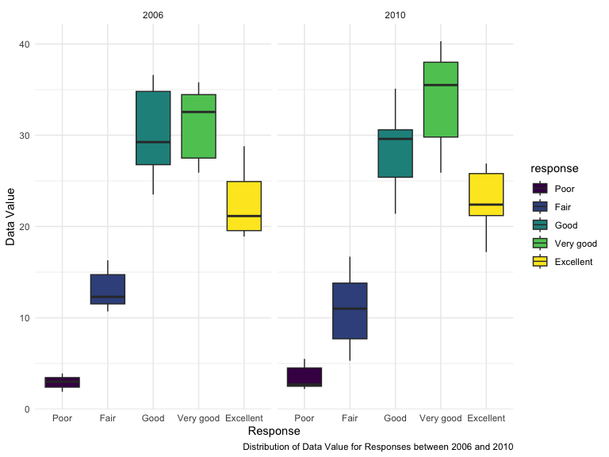

p8105_hw3_yy3421
================

## Problem 1

Loading dataset:

``` r
library(tidyverse)
```

    ## ── Attaching core tidyverse packages ──────────────────────── tidyverse 2.0.0 ──
    ## ✔ dplyr     1.1.3     ✔ readr     2.1.4
    ## ✔ forcats   1.0.0     ✔ stringr   1.5.0
    ## ✔ ggplot2   3.4.3     ✔ tibble    3.2.1
    ## ✔ lubridate 1.9.2     ✔ tidyr     1.3.0
    ## ✔ purrr     1.0.2     
    ## ── Conflicts ────────────────────────────────────────── tidyverse_conflicts() ──
    ## ✖ dplyr::filter() masks stats::filter()
    ## ✖ dplyr::lag()    masks stats::lag()
    ## ℹ Use the conflicted package (<http://conflicted.r-lib.org/>) to force all conflicts to become errors

``` r
library(ggridges)
library(patchwork)
knitr::opts_chunk$set(
    echo = TRUE,
    warning = FALSE,
    fig.width = 8, 
  fig.height = 6,
  out.width = "90%"
)
library(p8105.datasets)
data("instacart")

theme_set(theme_minimal() + theme(legend.position = "bottom"))

options(
  ggplot2.continuous.colour = "viridis",
  ggplot2.continuous.fill = "viridis"
)

scale_colour_discrete = scale_colour_viridis_d
scale_fill_discrete = scale_fill_viridis_d
```

### Question 1:

Group by aisle:

``` r
instacart_aisle = instacart |> 
  group_by(aisle)
```

``` r
n_item_max = instacart_aisle |> 
  summarise(n_item=n()) |> 
  arrange(desc(n_item))
```

There are 134 aisles. The most items are ordered from aisle “fresh
vegetables” with 150609 items.

### Question 2:

``` r
n_item_max |> 
  filter(
    n_item > 10000
  ) |> 
  ggplot(aes(x= reorder(aisle, +n_item), y = n_item))+
  geom_point() +
  labs(
    y = "Aisle",
    x = "Number of Items",
    caption = "Number of Items for Each Aisle with More than 10,000 Items"
  )+
  theme(axis.text.x = element_text(angle = 60, hjust = 1))
```


### Question 3:

``` r
instacart_aisle |> 
  group_by(aisle, product_name) |> 
  filter(
      aisle == "baking ingredients" | aisle == "dog food care" | aisle == "packaged vegetables fruits"
    ) |> 
  summarize(n_product = n()) |> 
  arrange(desc(n_product)) |> 
  mutate(
    product_rank = min_rank(desc(n_product))
    ) |> 
  filter(product_rank < 4) 
```

    ## `summarise()` has grouped output by 'aisle'. You can override using the
    ## `.groups` argument.

    ## # A tibble: 9 × 4
    ## # Groups:   aisle [3]
    ##   aisle                      product_name                 n_product product_rank
    ##   <chr>                      <chr>                            <int>        <int>
    ## 1 packaged vegetables fruits Organic Baby Spinach              9784            1
    ## 2 packaged vegetables fruits Organic Raspberries               5546            2
    ## 3 packaged vegetables fruits Organic Blueberries               4966            3
    ## 4 baking ingredients         Light Brown Sugar                  499            1
    ## 5 baking ingredients         Pure Baking Soda                   387            2
    ## 6 baking ingredients         Cane Sugar                         336            3
    ## 7 dog food care              Snack Sticks Chicken & Rice…        30            1
    ## 8 dog food care              Organix Chicken & Brown Ric…        28            2
    ## 9 dog food care              Small Dog Biscuits                  26            3

### Question 4:

``` r
instacart |> 
  group_by(order_dow, product_name) |> 
  filter(
    product_name == "Pink Lady Apples"| product_name == "Coffee Ice Cream"
  ) |> 
  summarize(
    mean_hour = mean(order_hour_of_day)
  ) |> 
  mutate(
    order_dow = order_dow +1
  ) |> 
  pivot_wider(
    names_from = product_name,
    values_from = mean_hour
  )
```

    ## `summarise()` has grouped output by 'order_dow'. You can override using the
    ## `.groups` argument.

    ## # A tibble: 7 × 3
    ## # Groups:   order_dow [7]
    ##   order_dow `Coffee Ice Cream` `Pink Lady Apples`
    ##       <dbl>              <dbl>              <dbl>
    ## 1         1               13.8               13.4
    ## 2         2               14.3               11.4
    ## 3         3               15.4               11.7
    ## 4         4               15.3               14.2
    ## 5         5               15.2               11.6
    ## 6         6               12.3               12.8
    ## 7         7               13.8               11.9

## Problem 2

Load data and clean:

``` r
library(p8105.datasets)
data("brfss_smart2010")
```

``` r
brfss_smart2010 = 
  brfss_smart2010 |> 
  janitor::clean_names() |> 
  filter(
    topic == "Overall Health",
    response == "Excellent"|response == "Very good"|response == "Good"|response == "Fair"|response == "Poor"
  ) |> 
  mutate(
    response = factor(response, levels = c("Excellent", "Very good", "Good", "Fair", "Poor"))
  ) |> 
  arrange(desc(response))
```

### Question 1:

``` r
brfss_smart2010_state = 
  brfss_smart2010 |> 
  group_by(locationabbr, locationdesc) |> 
  tally()
```

## Question 2:

``` r
brfss_smart2010 |> 
  filter(
    response == "Excellent"
  ) |> 
  select(year, locationabbr, data_value
  ) |> 
  group_by(locationabbr, year) |> 
  summarize(avg_data_value = mean(data_value, na.rm = TRUE)) |>
  ggplot(aes(
    x = year, 
    y = avg_data_value, 
    color = locationabbr,
    group = locationabbr))+
  geom_point()+
  geom_line()+
  labs(
    x = "Year",
    y = "Average Data Values",
    caption = "Change in Average Data Values from 2002 to 2010 for Each State"
  )
```

    ## `summarise()` has grouped output by 'locationabbr'. You can override using the
    ## `.groups` argument.


## Question 3:

``` r
brfss_smart2010 |> 
  filter(
    locationabbr == "NY",
    year == 2006 | year == 2010
  ) |> 
  ggplot(
    aes(
      x = response, y = data_value, fill = response
    )
  )+
  geom_boxplot()+
  facet_grid(~year)+
  labs(
    x = "Response",
    y = "Data Value",
    caption = "Distribution of Data Value for Responses between 2006 and 2010"
  )
```



## Problem 3

Cleaning and merging the two csv:

``` r
nhanes_accel = 
  read_csv("data/nhanes_accel.csv")
```

    ## Rows: 250 Columns: 1441
    ## ── Column specification ────────────────────────────────────────────────────────
    ## Delimiter: ","
    ## dbl (1441): SEQN, min1, min2, min3, min4, min5, min6, min7, min8, min9, min1...
    ## 
    ## ℹ Use `spec()` to retrieve the full column specification for this data.
    ## ℹ Specify the column types or set `show_col_types = FALSE` to quiet this message.

``` r
nhanes_covar = 
  read_csv("data/nhanes_covar.csv", skip = 4)
```

    ## Rows: 250 Columns: 5
    ## ── Column specification ────────────────────────────────────────────────────────
    ## Delimiter: ","
    ## dbl (5): SEQN, sex, age, BMI, education
    ## 
    ## ℹ Use `spec()` to retrieve the full column specification for this data.
    ## ℹ Specify the column types or set `show_col_types = FALSE` to quiet this message.

``` r
nhanes_df = 
  left_join(nhanes_covar, nhanes_accel, by = join_by(SEQN)) |> 
  janitor::clean_names()|> 
  filter(
    age>=21,
    is.na(bmi) == FALSE,
    is.na(education) == FALSE
  ) |> 
   mutate(
    sex = 
      case_match(
        sex,
        1 ~ "male",
        2 ~ "female"),
    sex = as.factor(sex),
    education =
      case_match(
        education,
        1 ~ "less than high school",
        2 ~ "high school equivalent",
        3 ~ "more than high school"),
    education = factor(education, levels = c("less than high school", "high school equivalent", "more than high school"))
   )
```
