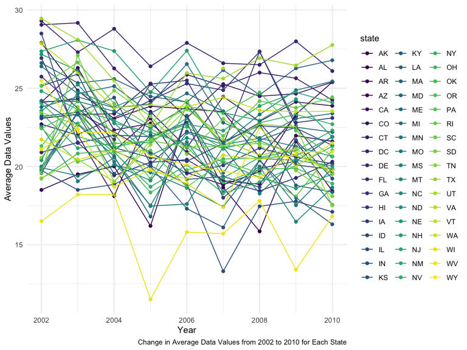
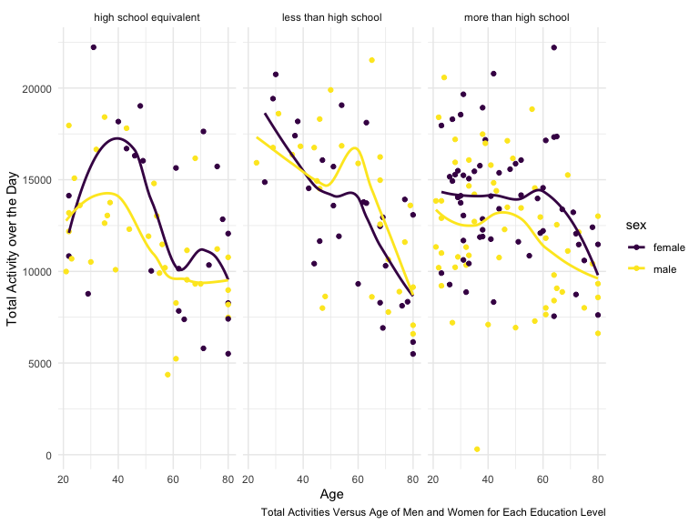

p8105_hw3_yy3421
================

## Problem 1

Loading dataset:

``` r
library(tidyverse)
```

    ## ── Attaching core tidyverse packages ──────────────────────── tidyverse 2.0.0 ──
    ## ✔ dplyr     1.1.3     ✔ readr     2.1.4
    ## ✔ forcats   1.0.0     ✔ stringr   1.5.0
    ## ✔ ggplot2   3.4.3     ✔ tibble    3.2.1
    ## ✔ lubridate 1.9.2     ✔ tidyr     1.3.0
    ## ✔ purrr     1.0.2     
    ## ── Conflicts ────────────────────────────────────────── tidyverse_conflicts() ──
    ## ✖ dplyr::filter() masks stats::filter()
    ## ✖ dplyr::lag()    masks stats::lag()
    ## ℹ Use the conflicted package (<http://conflicted.r-lib.org/>) to force all conflicts to become errors

``` r
library(ggridges)
library(patchwork)
knitr::opts_chunk$set(
    echo = TRUE,
    warning = FALSE,
    fig.width = 8, 
  fig.height = 6,
  out.width = "90%"
)
library(p8105.datasets)
data("instacart")

theme_set(theme_minimal() + theme(legend.position = "right"))

options(
  ggplot2.continuous.colour = "viridis",
  ggplot2.continuous.fill = "viridis"
)

scale_colour_discrete = scale_colour_viridis_d
scale_fill_discrete = scale_fill_viridis_d
```

### Question 1:

Group by aisle:

``` r
instacart_aisle = instacart |> 
  group_by(aisle)
```

``` r
n_item_max = instacart_aisle |> 
  summarise(n_item=n()) |> 
  arrange(desc(n_item))
```

There are 134 aisles. The most items are ordered from aisle “fresh
vegetables” with 150609 items.

### Question 2:

``` r
n_item_max |> 
  filter(
    n_item > 10000
  ) |> 
  ggplot(aes(x= reorder(aisle, +n_item), y = n_item))+
  geom_point() +
  labs(
    y = "Aisle",
    x = "Number of Items",
    caption = "Number of Items for Each Aisle with More than 10,000 Items"
  )+
  theme(axis.text.x = element_text(angle = 60, hjust = 1))
```


This point plot shows the number of items ordered in each aisle in an
ascending order.

### Question 3:

``` r
instacart_aisle |> 
  group_by(aisle, product_name) |> 
  filter(
      aisle == "baking ingredients" | aisle == "dog food care" | aisle == "packaged vegetables fruits"
    ) |> 
  summarize(n_product = n()) |> 
  arrange(desc(n_product)) |> 
  mutate(
    product_rank = min_rank(desc(n_product))
    ) |> 
  filter(product_rank < 4) |> 
  knitr::kable()
```

    ## `summarise()` has grouped output by 'aisle'. You can override using the
    ## `.groups` argument.

| aisle                      | product_name                                  | n_product | product_rank |
|:---------------------------|:----------------------------------------------|----------:|-------------:|
| packaged vegetables fruits | Organic Baby Spinach                          |      9784 |            1 |
| packaged vegetables fruits | Organic Raspberries                           |      5546 |            2 |
| packaged vegetables fruits | Organic Blueberries                           |      4966 |            3 |
| baking ingredients         | Light Brown Sugar                             |       499 |            1 |
| baking ingredients         | Pure Baking Soda                              |       387 |            2 |
| baking ingredients         | Cane Sugar                                    |       336 |            3 |
| dog food care              | Snack Sticks Chicken & Rice Recipe Dog Treats |        30 |            1 |
| dog food care              | Organix Chicken & Brown Rice Recipe           |        28 |            2 |
| dog food care              | Small Dog Biscuits                            |        26 |            3 |

The above table table shows the three most popular items in aisles
`baking ingredients`, `dog food care`, and `packaged vegetables fruits`,
and the number of times each item is ordered.

### Question 4:

``` r
instacart |> 
  group_by(order_dow, product_name) |> 
  filter(
    product_name == "Pink Lady Apples"| product_name == "Coffee Ice Cream"
  ) |> 
  summarize(
    mean_hour = mean(order_hour_of_day)
  ) |> 
  mutate(
    order_dow = order_dow +1
  ) |> 
  pivot_wider(
    names_from = product_name,
    values_from = mean_hour
  ) |> 
  knitr::kable(digits = 2)
```

    ## `summarise()` has grouped output by 'order_dow'. You can override using the
    ## `.groups` argument.

| order_dow | Coffee Ice Cream | Pink Lady Apples |
|----------:|-----------------:|-----------------:|
|         1 |            13.77 |            13.44 |
|         2 |            14.32 |            11.36 |
|         3 |            15.38 |            11.70 |
|         4 |            15.32 |            14.25 |
|         5 |            15.22 |            11.55 |
|         6 |            12.26 |            12.78 |
|         7 |            13.83 |            11.94 |

The last table shows the mean hour of the day at which Pink Lady Apples
and Coffee Ice Cream are ordered on every single day of the week. Pink
Lady Apples are generally purchased slightly earlier in the day than
Coffee Ice Cream, with the exception of day 5.

## Problem 2

Load data and clean:

``` r
library(p8105.datasets)
data("brfss_smart2010")
```

Data cleaning:

``` r
brfss_smart2010 = 
  brfss_smart2010 |> 
  janitor::clean_names() |> 
  rename(state = locationabbr, county = locationdesc) |> 
  filter(
    topic == "Overall Health",
    response == "Excellent"|response == "Very good"|response == "Good"|response == "Fair"|response == "Poor"
  ) |> 
  mutate(
    response = ordered(response, levels = c("Excellent", "Very good", "Good", "Fair", "Poor"))
  ) |> 
  arrange(desc(response))
```

### Question 1:

``` r
brfss_smart2002_state = 
  brfss_smart2010 |> 
  filter(
    year == 2002
  ) |> 
  group_by(state) |> 
  summarize(n_location = n_distinct(county)) |> 
  filter(
    n_location >= 7
  )

str(brfss_smart2002_state)
```

    ## tibble [6 × 2] (S3: tbl_df/tbl/data.frame)
    ##  $ state     : chr [1:6] "CT" "FL" "MA" "NC" ...
    ##  $ n_location: int [1:6] 7 7 8 7 8 10

``` r
brfss_smart2010_state = 
  brfss_smart2010 |> 
  filter(
    year == 2010
  ) |> 
  group_by(state) |> 
  summarize(n_location = n_distinct(county)) |> 
  filter(
    n_location >= 7)

str(brfss_smart2010_state)
```

    ## tibble [14 × 2] (S3: tbl_df/tbl/data.frame)
    ##  $ state     : chr [1:14] "CA" "CO" "FL" "MA" ...
    ##  $ n_location: int [1:14] 12 7 41 9 12 12 10 19 9 8 ...

There are 6 locations in 2002, which are CT, FL, MA, NC, NJ, PA.

There are 14 locations in 2010, which are CA, CO, FL, MA, MD, NC, NE,
NJ, NY, OH, PA, SC, TX, WA.

### Question 2:

``` r
brfss_excellent_avg =
  brfss_smart2010 |> 
  filter(
    response == "Excellent"
  ) |> 
  select(year, state, data_value
  ) |> 
  group_by(state, year) |> 
  summarize(avg_data_value = mean(data_value, na.rm = TRUE)) 
```

    ## `summarise()` has grouped output by 'state'. You can override using the
    ## `.groups` argument.

``` r
brfss_excellent_avg |> 
  ggplot(aes(
    x = year, 
    y = avg_data_value, 
    color = state,
    group = state))+
  geom_point()+
  geom_line()+
  labs(
    x = "Year",
    y = "Average Data Values",
    caption = "Change in Average Data Values from 2002 to 2010 for Each State"
  )
```



The `brfss_excellent_avg` data set contains only the information on the
state with `Excellent` responses. In this data set, the three variables
are `state`, `year`, and `avg_data_value`. Based on these three
variables, this dataset contains information on the average data values
of each state with `Excellent` reponse every year.

The plot above shows the change in average data values of each state,
only with Excellent responses, per year during the time period of 2002
to 2010. We can observe that each state has an obvious change in average
data value per year.

### Question 3:

``` r
brfss_smart2010 |> 
  filter(
    state == "NY",
    year == 2006 | year == 2010
  ) |> 
  ggplot(
    aes(
      x = response, y = data_value, fill = response
    )
  )+
  geom_boxplot()+
  facet_grid(~year)+
  labs(
    x = "Response",
    y = "Data Value",
    caption = "Distribution of Data Value for Responses between 2006 and 2010"
  )
```


The above two-panel plot compare the data value between year 2006 and
2010. In each year, the data value is further grouped based on the
response, `Excellent`, `Very good`, `Good`, `Fair`, and `Poor`. Based on
this plot, in 2006, responses `Very good` and `Good` have the highest
data values while response `Very good` has the highest data values in
2010. However, both years have `Poor` as the lowest data value response.

## Problem 3

Cleaning and merging the two csv:

``` r
nhanes_accel = 
  read_csv("data/nhanes_accel.csv") |> 
  janitor::clean_names() |> 
  pivot_longer(
    min1:min1440,
    names_to = "number_of_time",
    values_to = "activity_time",
    names_prefix = "min"
  )
```

    ## Rows: 250 Columns: 1441
    ## ── Column specification ────────────────────────────────────────────────────────
    ## Delimiter: ","
    ## dbl (1441): SEQN, min1, min2, min3, min4, min5, min6, min7, min8, min9, min1...
    ## 
    ## ℹ Use `spec()` to retrieve the full column specification for this data.
    ## ℹ Specify the column types or set `show_col_types = FALSE` to quiet this message.

``` r
nhanes_covar = 
  read_csv("data/nhanes_covar.csv", skip = 4) |> 
  janitor::clean_names() |> 
  filter(
    age>=21,
    is.na(bmi) == FALSE,
    is.na(education) == FALSE
  ) |> 
   mutate(
    sex = 
      case_match(
        sex,
        1 ~ "male",
        2 ~ "female"),
    sex = as.factor(sex),
    education =
      case_match(
        education,
        1 ~ "less than high school",
        2 ~ "high school equivalent",
        3 ~ "more than high school"),
    education = as.factor(education))
```

    ## Rows: 250 Columns: 5
    ## ── Column specification ────────────────────────────────────────────────────────
    ## Delimiter: ","
    ## dbl (5): SEQN, sex, age, BMI, education
    ## 
    ## ℹ Use `spec()` to retrieve the full column specification for this data.
    ## ℹ Specify the column types or set `show_col_types = FALSE` to quiet this message.

``` r
nhanes_df = 
  left_join(nhanes_covar, nhanes_accel, by = "seqn")
```

### Question 1:

Produce a reader-friendly table for the number of men and women in each
education category, and create a visualization of the age distributions
for men and women in each education category.

Table:

``` r
nhanes_covar |> 
  group_by(education, sex) |> 
  summarise(number =n()) |> 
  knitr::kable()
```

    ## `summarise()` has grouped output by 'education'. You can override using the
    ## `.groups` argument.

| education              | sex    | number |
|:-----------------------|:-------|-------:|
| high school equivalent | female |     23 |
| high school equivalent | male   |     35 |
| less than high school  | female |     28 |
| less than high school  | male   |     27 |
| more than high school  | female |     59 |
| more than high school  | male   |     56 |

The table above shows the number of people in each educaiton and sex
category. Based on this table, most of female and male have an education
level of `more than high school`.

Visualization of Age Distribution:

``` r
nhanes_covar |> 
  ggplot(aes(x = age, fill = sex))+
  geom_density(alpha=.5)+
  facet_grid(.~ education)+
  labs(
    x = "Age",
    y = "Distribution",
    caption = "Age Distribution of Men and Women in Each Education Category"
  )
```


The three-panel density plot above presents the age distribution for men
and women in each education category. In education levels
`high school equivalent` and `less than high school`, female has a
left-skewed and comparatively unimodal distribution. In these two
education levels, male has a bimodel distribution and comparatively
left-skewed distribution for `less than high school`. For
`more than high school`, both sex categories have a right-skewed
distribution.

### Question 2:

Traditional analyses of accelerometer data focus on the total activity
over the day. Using your tidied dataset, aggregate across minutes to
create a total activity variable for each participant. Plot these total
activities (y-axis) against age (x-axis); your plot should compare men
to women and have separate panels for each education level. Include a
trend line or a smooth to illustrate differences. Comment on your plot.

``` r
nhanes_df |> 
  group_by(seqn, sex, age, education) |> 
  summarize(total_activity = sum(activity_time)) |> 
  ggplot(aes(x = age, y = total_activity, color = sex))+
  geom_point()+
  geom_smooth(se = FALSE)+
  facet_grid(.~ education)+
  labs(
    x = "Age",
    y = "Total Activity over the Day",
    caption = "Total Activities Versus Age of Men and Women for Each Education Level"
  )
```

    ## `summarise()` has grouped output by 'seqn', 'sex', 'age'. You can override
    ## using the `.groups` argument.
    ## `geom_smooth()` using method = 'loess' and formula = 'y ~ x'



### Question 3:

Accelerometer data allows the inspection activity over the course of the
day. Make a three-panel plot that shows the 24-hour activity time
courses for each education level and use color to indicate sex. Describe
in words any patterns or conclusions you can make based on this graph;
including smooth trends may help identify differences.

``` r
nhanes_df |> 
  ggplot(aes(x = number_of_time, y = activity_time, group = seqn, color = sex))+
  geom_line(alpha = .2)+
  geom_smooth(aes(group = sex), se = FALSE)+
  facet_grid(.~ education)+
  labs(
    x = "Number of Time",
    y = "Activity Time",
    caption = "24-Hour Activity Time Courses for Each Educaiton Level"
  )
```

    ## `geom_smooth()` using method = 'gam' and formula = 'y ~ s(x, bs = "cs")'


